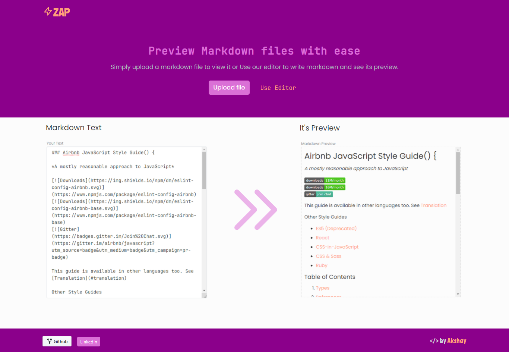
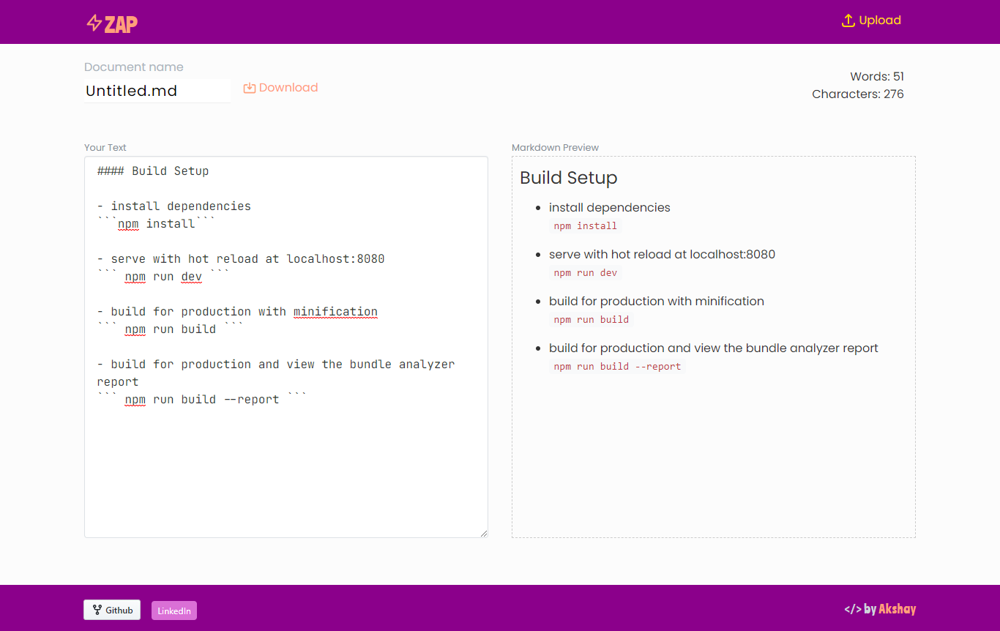
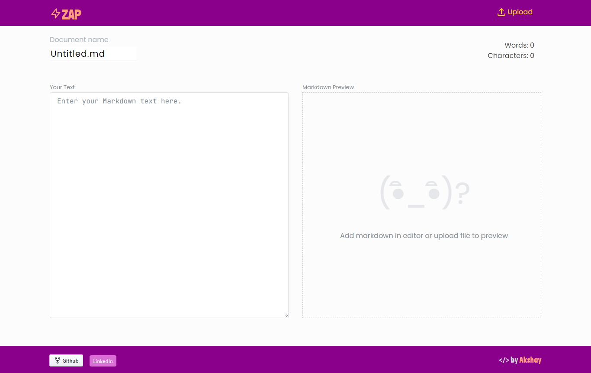

# vue_md_previewer

A markdown viewer made with **Vue.js**, [vue-markdown](https://github.com/miaolz123/vue-markdown) and **[Inkline](https://inkline.io/)** library.

## App Landing Page



## App Other Pages





```bash
# Project setup

npm install
```

```bash
# Compiles and hot-reloads for development

npm run serve
```

```bash
# Compiles and minifies for production

npm run build
```

```bash
# Lints and fixes files

npm run lint
```

### Customize configuration

See [Configuration Reference](https://cli.vuejs.org/config/).
